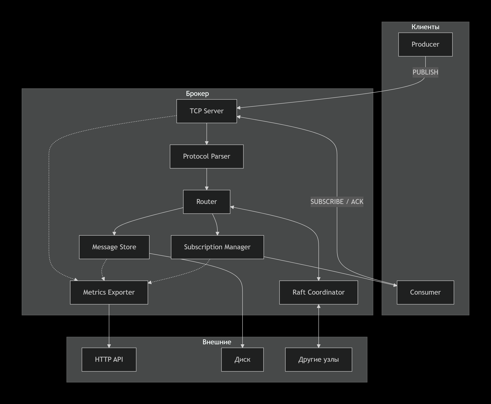

# My Message Broker

**My Message Broker** — это лёгкий, но мощный брокер сообщений, реализованный с нуля в учебных целях. Он поддерживает очереди (point‑to‑point) и топики (publish‑subscribe), гарантирует доставку *at‑least‑once*, обеспечивает персистентность на диске и может объединяться в кластер для отказоустойчивости и масштабирования.

Проект демонстрирует принципы работы распределённых очередей сообщений и подходит для использования в небольших и средних проектах, где требуется асинхронное взаимодействие между сервисами.

---

## Особенности

- **Две модели обмена**  
  - *Очередь* — сообщение получает только один потребитель (конкурирующие потребители).  
  - *Топик* — сообщение доставляется всем подписчикам.

- **Гарантии доставки**  
  Реализована стратегия **at‑least‑once**: сообщение не теряется, но может быть доставлено повторно. Подтверждение (`ACK`) обязательно для удаления сообщения из очереди.

- **Персистентность**  
  Все сообщения сохраняются на диск (WAL + индекс). При перезапуске брокера данные восстанавливаются.

- **Кластеризация**  
  Узлы объединяются в кластер с использованием консенсус‑алгоритма Raft. Метаданные реплицируются, сообщения шардируются или реплицируются (в зависимости от конфигурации).

- **Текстовый протокол**  
  Простой, удобный для отладки протокол поверх TCP. Клиенты общаются командами `PUBLISH`, `SUBSCRIBE`, `ACK` и др.

- **Мониторинг**  
  Встроенный HTTP‑сервер отдаёт метрики в формате JSON и Prometheus.

- **Безопасность**  
  Поддержка TLS и аутентификации по токену.

---

## Требования

- **Go** 1.21+ (для сборки из исходников)
- **Docker** (опционально, для запуска кластера)
- **Linux / macOS / Windows** (WSL2)

---

## Архитектура



---

## Установка

### Из исходников

```bash
git clone https://github.com/Khnykin-Artem/tselishchev.git
cd tselishchev
make build